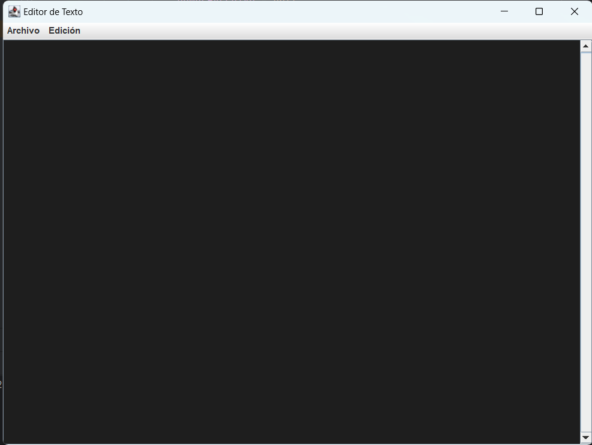

# Editor de Texto Simple en Java

Este proyecto es un editor de texto simple desarrollado en Java con interfaz gráfica de usuario (GUI) utilizando Swing. El editor de texto permite realizar operaciones básicas como abrir, guardar, buscar y reemplazar texto.

## Características

- Interfaz de usuario intuitiva con menús desplegables.
- Funcionalidades básicas de un editor de texto: Nuevo, Abrir, Guardar, Guardar como, Cerrar.
- Operaciones de edición: Copiar, Cortar, Pegar.
- Búsqueda y reemplazo de texto con resaltado de resultados.
- Modo oscuro y modo claro para la interfaz.

## Capturas de Pantalla

*Interfaz del Editor de Texto en modo oscuro*

## Uso

1. Descarga el proyecto.
2. Abre el proyecto en tu entorno de desarrollo Java.
3. Ejecuta la clase `EditorDeTexto` para iniciar el editor.
4. Utiliza las funcionalidades del menú para realizar operaciones en el editor.

## Contribuciones

¡Las contribuciones son bienvenidas! Si encuentras algún error o tienes alguna mejora, no dudes en crear un problema o enviar una solicitud de extracción.

## Licencia

Este proyecto está bajo la Licencia MIT - consulta el archivo [LICENSE](LICENSE) para obtener más detalles.

---
**NOTA:** Este proyecto fue creado con fines educativos y prácticos. Es un editor de texto simple y puede no ser adecuado para su uso en entornos de producción.

